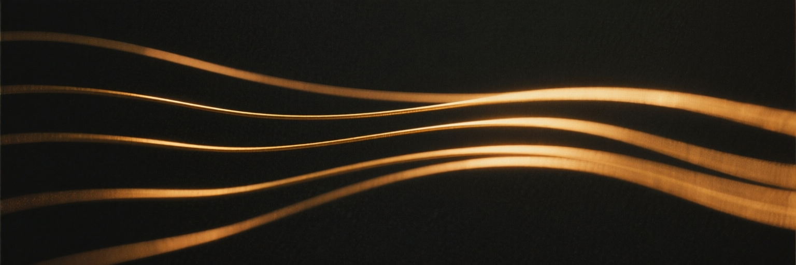

<p align="center">
  
</p>

<h1 align="center">
  
  Fermata
</h1>

**A self-hosted sheet music server.** Point it at a folder of sheet music, and
get a fast, beautiful library you can browse, search, tag, and practice from —
on any device on your network.

Think of it as the music-stand equivalent of Jellyfin or Calibre-Web: your
files stay yours, on your hardware, organized the way you already organize
them.

## Features

- **Library scanning** — walks your music folder, extracts titles, composers,
  collections, and page counts from folder structure and embedded PDF
  metadata, and generates cover thumbnails.
- **PDF practice reader** — continuous or paged reading, keyboard/pedal page
  turns (any Bluetooth pedal that sends arrow keys works), remembers your last
  page per piece, and a dark "practice room" inversion mode.
- **Notation / tab / both** — MusicXML and Guitar Pro files render
  interactively and can be switched between standard notation, tablature, or
  both staves at once, with audio playback, adjustable speed, and a moving
  cursor. The built-in synthesizer also drives practice tools: drag-select a
  passage on the score to loop it, plus a count-in. The
  staff is themed to match the interface, lays itself out differently on a
  phone, a tablet on a stand and a desktop, and can be drawn dark for
  practising in the dark — see [how scores are rendered](docs/rendering.md) for
  what the renderer does, what that layer adds, and why this renderer.
- **Tab out of a PDF** — engraved guitar PDFs carry their tab as real text and
  their rhythm in the music font's own glyphs, so Fermata reads both directly
  instead of guessing at pixels, and renders the result as a playable,
  editable staff beside the original page. Three music-font vocabularies are
  calibrated: Finale's Maestro, Sibelius's Opus, and any font following the
  SMuFL standard, which covers what free engravers such as MuseScore produce.
  A score drawn in something else still gives up its fret numbers, with the
  rhythm estimated from note spacing and labelled as such. The transcription
  is written as **MusicXML**, so it opens in other notation software rather
  than only here — see [the tab profile](docs/musicxml-tab-profile.md) for
  exactly what is written. Fret numbers, strings and chords come out reliably; how much of the
  rhythm survives depends on the engraving, and whatever stayed uncertain is
  listed with the staff rather than hidden. A bar that does not add up — because
  its voices were flattened into one, or a note was read short, or one was
  dropped — is reported as such, and that is a stated conformance rule of the
  profile, so any MusicXML tool finds the same bars from the file alone. Where
  one voice of a bar has to be filled out with silence for the bar to play in
  time, that silence is marked in the MusicXML, counted as missing rather than
  as read, and the bars it happened in are named. Scanned PDFs have nothing to
  read and are not transcribed. Harmonics are currently dropped rather than
  read — a gap worth knowing about separately, because a missing note announces
  itself only in the arithmetic of its bar, not in the note itself.
- **Instruments** — define what you actually play: any number of strings, any
  tuning including reentrant ones, a capo, and a reference pitch other than
  A440. Each string shows the note and frequency it sounds and can be played,
  because choosing between two positions for the same written note is done by
  ear, and on an unfretted instrument a heard pitch is the reference rather
  than a convenience. Presets cover guitars, basses, ukulele, violin, viola and
  cello. Transcription does not yet use a score's instrument — it still assumes
  a six-string guitar in standard tuning.
- **Metronome, everywhere** — one click, available over a piece, on the
  practice page, and on a page of its own, because "I just want a metronome" is
  a real thing to want from a practice tool. Wherever it appears it arrives
  already set up for that context — over a piece, to that piece's tempo and
  time signature — and every pre-filled value is still adjustable, because a
  marking is sometimes wrong, sometimes aspirational, and frequently not the
  speed a passage should be practised at today. Tempo is settable as a
  proportion of the piece from 15% to 175% (far below half speed, because for a
  passage that is beyond you half speed is not slow enough) or as a fixed
  number, one beat per minute at a time. When a setting asks for a click slower
  or faster than one can actually be sounded, it shows the rate it is really
  clicking at and says plainly that it is at the end of its range, rather than
  leaving a percentage on screen that has stopped describing what you hear. It
  does not use the renderer's own
  metronome, which cannot run at a tempo different from the notes beside it —
  see [how scores are rendered](docs/rendering.md).
- **Practice tracking** — a session timer per piece, with recently-practised
  and neglected views so the library reflects what you are actually working on.
  A session can record what the work was: which bars or pages, at what tempo,
  section work or a run-through, and how it went. Practice that is not a piece
  at all — technique, ear training, simply playing — is recorded the same way
  and in the same history ([the data model](docs/practice-data.md)).
- **Hear a note, name it** — the first exercise: a pitch sounds, and you name it
  from four. The three you did not hear are chosen to be worth confusing — a
  semitone away, the same name an octave out, and one a step or two off — because
  four notes far apart teaches nothing. Hear it again as often as you like,
  before and after answering, and nothing counts that. With one instrument
  defined the drill draws from that instrument's own range; with several it uses
  a plain four octaves, because Fermata knows what you own and not which one is
  in your hands. Two counts are stated and nothing is graded: there is no
  accuracy percentage and no streak, and a note you could not name is what the
  practice consists of. The time lands in your practice history as ear training
  and counts towards a weekly goal like anything else.
- **Weekly goals, and an honest review** — how many days you mean to practise
  and for how long, on what. While the week runs it says where you stand so the
  goal can still change it; afterwards it states plainly what happened and asks
  whether the goal was realistic. No streaks, no comparison with a better week,
  and nothing that grades you for a week that did not go to plan.
- **Gig mode** — fullscreen, screen kept awake, oversized tap targets and
  half-page turns for a tablet on a music stand.
- **Organize** — collections (from your folder layout), free-form tags,
  favorites, content-type labels (notation / tab / both), full-text search,
  and duplicate detection by file contents.
- **Upload** — drag files in through the browser; they land in your library
  folder and are indexed immediately.
- **Single container** — SQLite inside, two volume mounts, no external
  services.

## Quick start

```bash
git clone <this repo>
cd fermata
mkdir -p library config
# put some sheet music in ./library (PDF, MusicXML, Guitar Pro)
docker compose up --build -d
```

Open http://localhost:8080 — your library is scanned automatically on startup,
or hit **Scan library** in the sidebar.

See [the deployment guide](docs/deployment.md) for backups, upgrading, and
current limitations — read that before deciding whether this belongs on your
home network.

### Volumes

| Mount           | Purpose                                        |
| --------------- | ---------------------------------------------- |
| `/data/library` | Your sheet music files (read + uploads)        |
| `/data/config`  | Database, thumbnails, cache — back this up     |

Fermata creates `/data/config` if it needs to, but never `/data/library` — a
library folder that isn't there is usually a volume that didn't mount, and an
empty one is indistinguishable from a library with nothing in it. It stops with
an explanation instead, and recovers by itself once the mount appears.

## Development

Backend (FastAPI, Python 3.12):

```bash
cd server
pip install -e .
FERMATA_LIBRARY=../library FERMATA_CONFIG=../config uvicorn fermata.main:app --port 8080 --reload
```

Frontend (Svelte 5 + Vite, proxies `/api` to :8080):

```bash
cd web
npm install
npm run dev
```

Everything to do with drawing a staff — appearance, responsive layout, and the
renderer's quirks — lives in `web/src/lib/score-render.js`; components never
touch the renderer directly. [docs/rendering.md](docs/rendering.md) explains
that boundary and the decisions behind it.

Tests:

```bash
cd server
pip install -e ".[dev]"
python -m pytest -q
```

Tests that need real sheet music read it from `FERMATA_TEST_LIBRARY` and skip
when it is unset. Setting `FERMATA_MUSICXML_XSD` to a local copy of the
MusicXML 4.0 schema additionally validates the emitted transcriptions against
it — see [the tab profile](docs/musicxml-tab-profile.md#checking-a-file).

## Formats

| Format | How it reads |
| --- | --- |
| PDF, engraved with a tab staff | Practice reader, plus transcription to MusicXML — a playable staff beside the page, and a file other notation software reads ([profile](docs/musicxml-tab-profile.md)) |
| PDF, engraved without tab | Practice reader; nothing to transcribe from |
| PDF, scanned | Practice reader only — a scan holds no text or glyphs to read |
| MusicXML (`.musicxml`, `.mxl`) | Interactive: notation / tab / both, audio, full fidelity |
| Guitar Pro (`.gp3`–`.gp5`, `.gpx`, `.gp`) | Interactive: notation / tab / both, audio |

A PDF is a fixed rendering, so the notation/tab toggle belongs to the
structured formats — and to a transcription made from a PDF, which is what the
side-by-side view is for. There's a bundled demo (sidebar → *Notation/tab
demo*) if your library is PDF-only so far.

## Roadmap

- **Harmonics when transcribing** — currently dropped entirely, which leaves a
  hole in the music rather than a mistake in it, and shortens the bar they
  belonged to
- **Tuplets and ties when transcribing** — the largest remaining gap between a
  transcription and a score you could practise from, and the reason bars still
  overfill once voices have been separated
- **Instrument-aware transcription** — reading a score against the instrument it
  is written for, instead of assuming standard six-string tuning whatever the
  score says
- **Score creation and editing** — build a staff from scratch in the browser,
  instrument-agnostic with first-class guitar tablature support
- **More import formats** — MIDI and plain-text tab in particular, since those
  accompany most freely-licensed sheet music you can download
- **A fretboard trainer** — note finding, chord flash cards and reach drills,
  scoped to the strings and frets you are working on
- Setlists, and recognition for what you have accomplished over time
- Annotations on PDFs (fingerings, markings)
- Reverse proxy authentication, then multi-user accounts
- Splitting compilation books into individual pieces
- Tablet-first PWA mode with pedal-friendly full-screen
- Recognition for scanned PDFs, which carry no readable text or glyphs

## License

[MIT](LICENSE)
